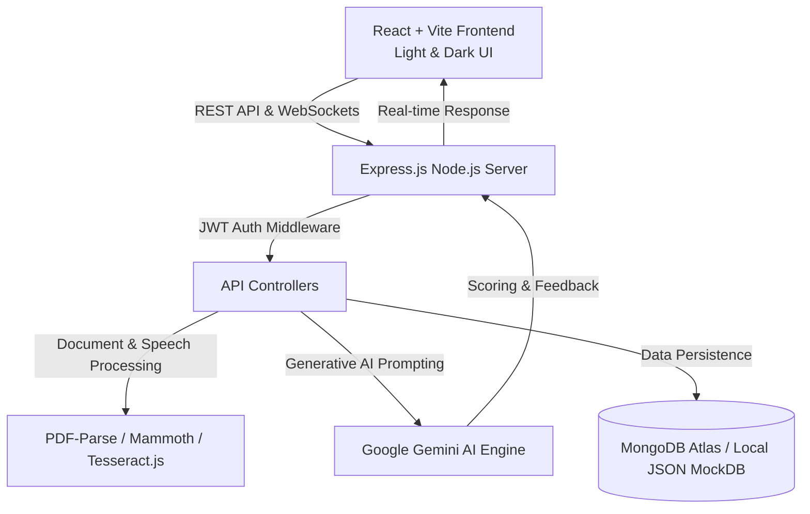

# 🚀 AIHireX — AI-Powered Resume Screening & Recruitment Platform

<p align="center">
  
  
  
  
  
</p>

---

## 🌟 Overview

**AIHireX** is a next-generation AI-driven recruitment and career acceleration ecosystem. Built using the **MERN Stack** (MongoDB, Express.js, React, Node.js) and powered by **Google Gemini 2.5 AI**, AIHireX bridges the gap between ambitious candidates and modern hiring teams.

- **For Job Seekers**: Instant ATS resume score calculation, missing keyword detection, AI-generated cover letters, interactive mock interviews with speech feedback, and personalized career roadmaps.
- **For Recruiters**: Automated candidate screening, intelligent ranking, transparent AI copilot candidate discovery, and streamlined requisition pipeline management.

---

## 🏗️ System Architecture



---

## ✨ Feature Breakdown

### 👤 1. Candidate Workspace
- **⚡ Real-time ATS Resume Analyzer**: Parses PDF and DOCX resumes, calculates a 0–100 compatibility score, detects missing technical keywords, and suggests actionable bullet point fixes.
- **🎙️ Interactive AI Mock Interviewer**: Simulates real technical and behavioral interviews using Google Gemini AI with real-time scoring, transcript analysis, and custom response feedback.
- **🎯 Career Roadmap & Skill Gap Engine**: Identifies missing skillsets against target target job profiles and generates step-by-step learning roadmaps.
- **📝 AI Material Generator**: Generates customized cover letters, professional summaries, and optimized resume bullet points tailored to specific job requisitions.
- **📊 Active Applications Workspace**: Tracks application stages, next action items, and interview deadlines in one cohesive dashboard.

### 💼 2. Recruiter Command HQ
- **📋 Job Requisition Workspace**: Publish, edit, and manage active job listings with target skill tags and requirements.
- **🥇 Automated Candidate Ranking**: Ranks incoming candidate applications instantly based on calculated ATS match scores and skill alignments.
- **🤖 AI Recruiter Copilot**: Interactive AI search tool that evaluates candidates and provides natural language justifications for shortlist recommendations.
- **✉️ Automated Candidate Dispatcher**: Send interview invitations and update pipeline stage statuses directly from the recruiter workspace.

### 🛡️ 3. Admin & Auditing Suite
- **📈 Platform Metrics**: Audit user registrations, active job posts, application completion rates, and platform health.
- **💸 AI Usage & Cost Auditor**: Monitors Gemini API token consumption, cost metrics, and request latency.

---

## 💻 Tech Stack & Libraries

| Layer | Technology | Purpose |
| :--- | :--- | :--- |
| **Frontend** | React 18 (Vite) | Single Page Application framework with high HMR speed |
| **Styling** | Tailwind CSS & Vanilla CSS | Responsive Light/Dark theme system with modern aesthetics |
| **Icons & Charts** | Lucide Icons, Recharts | Dynamic icons and analytics data visualizations |
| **Backend** | Node.js, Express.js | High-throughput REST API server |
| **Database** | MongoDB (Mongoose) / `mockDb.js` | Database layer with zero-config JSON file fallback |
| **AI Core** | `@google/generative-ai` | Google Gemini AI integration for analysis and mock interviews |
| **File Processing** | Multer, PDF-Parse, Mammoth, Tesseract.js | PDF/DOCX parsing and OCR text extraction |

---

## 🔌 Core API Reference

| Endpoint | Method | Description |
| :--- | :--- | :--- |
| `/api/auth/register` | `POST` | Register a new Candidate or Recruiter account |
| `/api/auth/login` | `POST` | Authenticate user and issue JWT bearer token |
| `/api/resumes/analyze` | `POST` | Upload & parse resume for ATS score calculation |
| `/api/ai/mock-interview` | `POST` | Generate interview questions and score responses |
| `/api/ai/cover-letter` | `POST` | Generate customized cover letter for a job |
| `/api/jobs` | `GET` / `POST` | Fetch job listings or post new job requisition |
| `/api/admin/stats` | `GET` | Retrieve platform usage analytics & AI token audits |

---

## 🚀 Quick Setup & Installation

### Prerequisites
- **Node.js** (v18.x or higher)
- **npm** (v9.x or higher)
- **Google Gemini API Key** (Get free key from [Google AI Studio](https://aistudio.google.com/))

### 1. Clone the Repository
```bash
git clone https://github.com/rupesh-singh20/Ai-Resume-Screener.git
cd Ai-Resume-Screener
```

### 2. Configure Environment Variables
Create a `.env` file in the project root directory:
```env
PORT=5000
MONGODB_URI=your_mongodb_connection_string
JWT_SECRET=your_jwt_secret_key
GEMINI_API_KEY=your_google_gemini_api_key
```

### 3. Install & Start Backend Server
```bash
cd server
npm install
npm run dev
```
*Backend runs on `http://localhost:5000`*

### 4. Install & Start Frontend Client
```bash
cd client
npm install
npm run dev
```
*Frontend runs on `http://localhost:5173`*

---

## 📁 Repository Structure

```text
AIHireX/
├── client/                     # Frontend React (Vite) Application
│   ├── public/                 # Static assets & icons
│   ├── src/
│   │   ├── components/         # Reusable UI components & modals
│   │   ├── context/            # Auth, Theme & Toast state providers
│   │   ├── pages/              # Application pages (Dashboard, Landing, Jobs, etc.)
│   │   ├── App.jsx             # Main Router & layout shell
│   │   └── index.css           # Design system tokens & Tailwind CSS
│   └── tailwind.config.js      # Tailwind theme configuration
├── server/                     # Backend Express.js Server
│   ├── config/                 # Database configuration
│   ├── controllers/            # Route controllers & AI logic handlers
│   ├── middleware/             # JWT auth & validation middlewares
│   ├── models/                 # Mongoose schemas (User, Job, Resume, Application)
│   ├── routes/                 # Express API routes
│   ├── services/               # Gemini AI & File parser services
│   └── server.js               # Express application entry point
├── README.md                   # Project documentation
└── .gitignore                  # Git ignore rules
```

---

## 📄 License & Credits

Designed and developed for **AIHireX Platform**.
- **AI Engine**: Google Gemini API
- **License**: [MIT License](LICENSE)

---

<p align="center">
  <b>Built with ❤️ using MERN Stack & Google Gemini AI</b>
</p>
